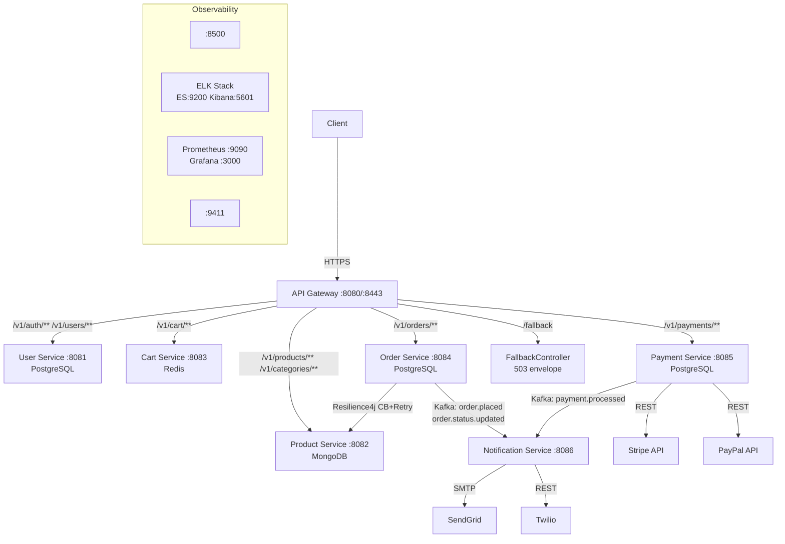

# 🛒 Scalable E-Commerce Platform

A **production-ready, microservices-based e-commerce platform** built with Java 21, Spring Boot 3, and Docker. Every feature is an independent, containerised microservice with its own database, CI/CD pipeline, and OpenAPI specification — demonstrating real-world distributed systems design at scale.

---

## 🎯 Project Purpose

This project was built to demonstrate enterprise-level software engineering skills across the full stack of a modern distributed system:

- **Microservices architecture** — each service is independently deployable, scalable, and fault-tolerant
- **Event-driven design** — services communicate asynchronously via Apache Kafka for loose coupling
- **API Gateway pattern** — single entry point with RS256 JWT validation, rate limiting, CORS, HTTPS, and circuit-breaker fallback
- **Observability** — centralised structured logging (ELK Stack), distributed metrics (Prometheus + Grafana), distributed tracing (Zipkin / Micrometer Tracing), and service discovery (Consul)
- **Resilience** — Resilience4j circuit breakers and retry policies on inter-service HTTP calls with graceful degradation fallbacks
- **Security-first** — RS256 JWT access tokens, refresh token rotation, BCrypt password hashing, no hardcoded secrets, TLS everywhere
- **CI/CD** — GitHub Actions pipelines per service with OIDC-based image pushing to GitHub Container Registry, JaCoCo coverage gates, and multi-platform Docker builds

This is the kind of platform that powers companies like Amazon, Shopify, and eBay at their core.

---

## 🏗 Architecture

### ASCII Diagram

```
                        ┌──────────────────────────────────────────────────────────────┐
                        │            API Gateway  (port 8080 / 8443 HTTPS)              │
                        │         Spring Cloud Gateway — RS256 JWT validation           │
                        │   Rate limiting · CORS · Circuit-breaker fallback /fallback   │
                        └──────┬──────┬──────┬──────┬──────┬────────────────────────────┘
                               │      │      │      │      │
               ┌───────────────┘      │      │      │      └─────────────────┐
               │                      │      │      │                         │
               ▼                      ▼      ▼      ▼                         ▼
    ┌──────────────────┐  ┌───────────────┐  ┌────────────────┐  ┌──────────────────┐
    │   User Service   │  │Product Service│  │  Cart Service  │  │  Order Service   │
    │   (port 8081)    │  │  (port 8082)  │  │  (port 8083)   │  │  (port 8084)     │
    │   PostgreSQL     │  │   MongoDB     │  │    Redis       │  │  PostgreSQL      │
    │ Refresh tokens   │  │               │  │                │  │  CB + Retry ─────┼──► Product Svc
    └──────────────────┘  └───────────────┘  └────────────────┘  └────────┬─────────┘
                                                                           │ Kafka Events
                                                          ┌────────────────┘
                                                          ▼
                                              ┌─────────────────────┐
                                              │   Payment Service   │◄── Stripe / PayPal
                                              │    (port 8085)      │
                                              │    PostgreSQL       │
                                              └──────────┬──────────┘
                                                         │ Kafka Events
                                              ┌──────────┘
                                              │  Topics: order.placed
                                              │           payment.processed
                                              │           order.status.updated
                                              ▼
                                  ┌─────────────────────────┐
                                  │  Notification Service   │
                                  │      (port 8086)        │
                                  │  SendGrid + Thymeleaf   │
                                  │  Twilio SMS             │
                                  └─────────────────────────┘

  Infrastructure:
  ┌──────────┐  ┌────────────────────────┐  ┌─────────────────────┐  ┌──────────────┐
  │  Consul  │  │  ELK Stack             │  │  Prometheus+Grafana  │  │  Zipkin      │
  │  :8500   │  │  ES:9200  Kibana:5601  │  │  :9090      :3000    │  │  :9411       │
  └──────────┘  └────────────────────────┘  └─────────────────────┘  └──────────────┘
```

### Mermaid Diagram



### Inter-Service Communication

| Type | Technology | Used for |
|---|---|---|
| Synchronous | REST over HTTP via Gateway | Client-facing requests (register, browse products, place order) |
| Asynchronous | Apache Kafka (3 topics, 3 partitions each) | Internal domain events (order placed → email/SMS) |
| Resilience | Resilience4j Circuit Breaker + Retry | Order Service → Product Service (stock validation) |

### Kafka Topics

| Topic | Producer | Consumer | Trigger |
|---|---|---|---|
| `order.placed` | Order Service | Notification Service | Order confirmed — send order confirmation email |
| `order.status.updated` | Order Service | Notification Service | Status change — send shipping update email/SMS |
| `payment.processed` | Payment Service | Notification Service | Payment success/failure — send receipt or failure alert |

---

## 📦 Services at a Glance

| Service | Port | Database | Key Responsibilities |
|---|---|---|---|
| **API Gateway** | 8080 / 8443 | Redis (rate limiter) | RS256 JWT validation, routing, rate limiting, CORS, HTTPS, circuit-breaker fallback |
| **User Service** | 8081 | PostgreSQL | Registration, login, refresh token rotation, RBAC (ROLE_ADMIN / ROLE_CUSTOMER) |
| **Product Service** | 8082 | MongoDB | Product & category CRUD, full-text search, pagination, stock management |
| **Cart Service** | 8083 | Redis | Per-user cart CRUD with configurable TTL expiration |
| **Order Service** | 8084 | PostgreSQL | Order lifecycle FSM, idempotency, Resilience4j product validation, Kafka events |
| **Payment Service** | 8085 | PostgreSQL | Stripe PaymentIntent, PayPal Orders API, webhook handling, refunds |
| **Notification Service** | 8086 | None (stateless) | Thymeleaf HTML emails (SendGrid) + SMS (Twilio) driven by Kafka events |

---

## ✅ Prerequisites

| Tool | Version | Purpose | Install |
|---|---|---|---|
| **Docker Desktop** | 4.x+ | Runs all 21 containers | [docker.com/get-docker](https://www.docker.com/get-docker) |
| **Docker Compose** | v2 (bundled) | Orchestrates the full stack | Included with Docker Desktop |
| **Git** | Any | Clone this repository | [git-scm.com](https://git-scm.com/) |
| **Java 21** | 21 LTS | Build & test locally (optional) | [adoptium.net](https://adoptium.net/) |
| **Maven** | 3.9+ | Build tool (optional) | [maven.apache.org](https://maven.apache.org/) |

> **Tip:** Java and Maven are only needed to run services or tests **without** Docker. The entire stack runs from Docker Desktop alone.

---

## 🚀 Quick Start — Run the Full Platform

### Step 1 — Clone

```bash
git clone https://github.com/YOUR_USERNAME/scalable-ecommerce-platform.git
cd scalable-ecommerce-platform
```

### Step 2 — Create your `.env` file

```bash
cp .env.example .env
```

**Generate the RSA key pair for JWT signing (PKCS8 format required by Spring Security):**

```bash
openssl genrsa -out private.pem 4096
openssl pkcs8 -topk8 -inform PEM -outform PEM -nocrypt -in private.pem -out private-pkcs8.pem
openssl rsa -in private.pem -pubout -out public.pem

# Paste these into your .env file:
echo "JWT_PRIVATE_KEY=$(cat private-pkcs8.pem | tr '\n' '|' | sed 's/|/\\n/g')"
echo "JWT_PUBLIC_KEY=$(cat public.pem | tr '\n' '|' | sed 's/|/\\n/g')"

rm private.pem private-pkcs8.pem public.pem
```

**Add third-party API keys** (all services have free sandbox/trial tiers):

```bash
# Stripe — https://dashboard.stripe.com → Developers → API Keys
STRIPE_API_KEY=sk_test_...
STRIPE_WEBHOOK_SECRET=whsec_...

# SendGrid — https://app.sendgrid.com → Settings → API Keys
SENDGRID_API_KEY=SG....

# Twilio — https://console.twilio.com
TWILIO_ACCOUNT_SID=AC...
TWILIO_AUTH_TOKEN=...
TWILIO_FROM_NUMBER=+1...

# PayPal — https://developer.paypal.com → Apps & Credentials
PAYPAL_CLIENT_ID=...
PAYPAL_CLIENT_SECRET=...
```

### Step 3 — Generate TLS certificates (HTTPS)

```bash
bash infrastructure/certs/generate-certs.sh
```

Creates `infrastructure/certs/keystore.p12` (password: `changeme_keystore`) for the Gateway HTTPS listener on port 8443.

### Step 4 — Start everything

```bash
docker compose up --build
```

**First run:** Maven downloads ~500 MB of dependencies and compiles 7 services. Allow **8–12 minutes**. Subsequent starts take under 60 seconds.

### Step 5 — Verify and explore

```bash
docker compose ps          # all containers should show "healthy"
docker compose logs -f gateway   # watch gateway startup
```

Open the platform UIs:

| UI | URL | Credentials |
|---|---|---|
| **API Gateway** | https://localhost:8443 | — |
| **API Docs (OpenAPI)** | https://localhost:8443/docs | — |
| **Consul Service Registry** | http://localhost:8500 | — |
| **Grafana Dashboards** | http://localhost:3000 | `admin` / `admin` |
| **Kibana Log Explorer** | http://localhost:5601 | — |
| **Prometheus Metrics** | http://localhost:9090 | — |
| **Zipkin Trace UI** | http://localhost:9411 | — |

> **Self-signed certificate warning:** Click **Advanced → Proceed to localhost (unsafe)** in Chrome/Firefox. This is expected for local development.

---

## 🧪 Testing the APIs

All responses follow the standard envelope:
```json
{ "status": "success|error", "data": {}, "message": "..." }
```

### Auth flow

```bash
# 1. Register — returns access token (24 h) + refresh token (7 d)
curl -k -X POST https://localhost:8443/v1/auth/register \
  -H "Content-Type: application/json" \
  -d '{"email":"alice@example.com","password":"SecurePass123!","firstName":"Alice","lastName":"Smith"}'

# Response:
# { "status":"success", "data":{ "token":"<JWT>", "refreshToken":"<opaque>", "tokenType":"Bearer", ... } }

# 2. Save tokens
TOKEN=<accessToken from above>
REFRESH=<refreshToken from above>

# 3. Log in (existing users)
curl -k -X POST https://localhost:8443/v1/auth/login \
  -H "Content-Type: application/json" \
  -d '{"email":"alice@example.com","password":"SecurePass123!"}'

# 4. Refresh expired access token (old refresh token is immediately revoked)
curl -k -X POST https://localhost:8443/v1/auth/refresh \
  -H "Content-Type: application/json" \
  -d "{\"refreshToken\":\"$REFRESH\"}"

# 5. Logout (revoke refresh token)
curl -k -X POST https://localhost:8443/v1/auth/logout \
  -H "Content-Type: application/json" \
  -d "{\"refreshToken\":\"$REFRESH\"}"
# → 204 No Content
```

### Products (public — no token needed)

```bash
# List products with pagination and filtering
curl -k "https://localhost:8443/v1/products?page=0&size=10&sort=name,asc"

# Get single product (includes current stock)
curl -k "https://localhost:8443/v1/products/{productId}"

# List categories
curl -k "https://localhost:8443/v1/categories"
```

### Cart

```bash
USER_ID=<your userId from register response>

# Add item
curl -k -X POST "https://localhost:8443/v1/cart/$USER_ID/items" \
  -H "Authorization: Bearer $TOKEN" \
  -H "Content-Type: application/json" \
  -d '{"productId":"PRODUCT_ID","productName":"Widget","quantity":2,"unitPrice":29.99}'

# View cart
curl -k "https://localhost:8443/v1/cart/$USER_ID" \
  -H "Authorization: Bearer $TOKEN"

# Remove item
curl -k -X DELETE "https://localhost:8443/v1/cart/$USER_ID/items/PRODUCT_ID" \
  -H "Authorization: Bearer $TOKEN"
```

### Place an order (validates stock via Resilience4j-protected Product Service call)

```bash
curl -k -X POST https://localhost:8443/v1/orders \
  -H "Authorization: Bearer $TOKEN" \
  -H "Content-Type: application/json" \
  -d '{
    "userId": "'$USER_ID'",
    "items": [{"productId":"PRODUCT_ID","productName":"Widget","quantity":1,"unitPrice":29.99}],
    "shippingAddress": "123 Main St, New York, NY 10001",
    "idempotencyKey": "order-attempt-001"
  }'
```

> Submitting the same `idempotencyKey` twice returns the existing order without creating a duplicate — safe to retry on network error.

### Payment

```bash
# Create Stripe PaymentIntent for an order
curl -k -X POST https://localhost:8443/v1/payments/stripe/intent \
  -H "Authorization: Bearer $TOKEN" \
  -H "Content-Type: application/json" \
  -d '{"orderId":"ORDER_ID","currency":"usd"}'

# Create PayPal order
curl -k -X POST https://localhost:8443/v1/payments/paypal/order \
  -H "Authorization: Bearer $TOKEN" \
  -H "Content-Type: application/json" \
  -d '{"orderId":"ORDER_ID","currency":"USD"}'
```

---

## 🧑‍💻 Running Tests

### Single service

```bash
cd services/user-service
mvn test
```

### With JaCoCo coverage report

```bash
cd services/user-service
mvn verify
open target/site/jacoco/index.html      # macOS
xdg-open target/site/jacoco/index.html  # Linux
```

### All services + gateway

```bash
for svc in gateway services/*/; do
  printf '\n=== %s ===\n' "$svc"
  (cd "$svc" && mvn test -q)
done
```

### Test inventory

| Service | Test classes | Coverage areas |
|---|---|---|
| **Gateway** | `FallbackControllerTest` · `JwtAuthenticationGatewayFilterTest` · `GatewayRoutesConfigTest` | CB 503 fallback · JWT public-path bypass · route wiring |
| **User Service** | `AuthServiceTest` · `AuthControllerTest` · `RefreshTokenServiceTest` · `UserServiceTest` · `UserControllerTest` | Register/login/refresh/logout · RBAC · token rotation |
| **Product Service** | `ProductServiceTest` · `ProductControllerTest` · `CategoryServiceTest` · `CategoryControllerTest` | CRUD · stock update · pagination · search |
| **Cart Service** | `CartServiceTest` · `CartControllerTest` | Add/update/remove/clear · TTL expiry |
| **Order Service** | `OrderServiceTest` · `OrderControllerTest` · `ProductValidationServiceTest` | Idempotency · stock validation · CB fallback · status FSM |
| **Payment Service** | `PaymentServiceTest` · `PaymentControllerTest` · `StripeServiceTest` · `PayPalServiceTest` | Stripe intent · PayPal capture · webhook · refund |
| **Notification Service** | `EmailServiceTest` · `SmsServiceTest` · `NotificationKafkaConsumerTest` | Thymeleaf rendering · SendGrid · Twilio |

**Total test classes: 25** across all services and gateway.

---

## 🐳 Docker Reference

```bash
# Start full stack (builds from source)
docker compose up --build

# Start in background
docker compose up --build -d

# Stop (keep volumes / data)
docker compose down

# Stop and wipe all data (fresh start)
docker compose down -v

# Stream logs for one service
docker compose logs -f order-service

# Scale a stateless service horizontally
docker compose up --scale product-service=3 -d

# Rebuild and hot-swap a single service
docker compose up --build user-service -d

# Health summary
docker compose ps
```

---

## 📁 Project Structure

```
.
├── gateway/                          # Spring Cloud Gateway (API entry point)
│   ├── Dockerfile
│   ├── pom.xml
│   └── src/main/java/…/
│       ├── config/
│       │   ├── GatewayRoutesConfig.java    # /v1/ route definitions + CB filters
│       │   ├── RateLimiterConfig.java       # Redis-backed token-bucket rate limiting
│       │   ├── SecurityConfig.java
│       │   └── CorsConfig.java
│       ├── controller/
│       │   └── FallbackController.java      # 503 JSON envelope when circuit opens
│       └── filter/
│           ├── JwtAuthenticationGatewayFilter.java
│           └── RequestLoggingGatewayFilter.java
├── services/
│   ├── user-service/          # Auth, JWT issuance, refresh token rotation (PostgreSQL)
│   ├── product-service/       # Products, categories, inventory (MongoDB)
│   ├── cart-service/          # Shopping cart with TTL (Redis)
│   ├── order-service/         # Order lifecycle, Resilience4j validation (PostgreSQL)
│   ├── payment-service/       # Stripe + PayPal, webhooks, refunds (PostgreSQL)
│   └── notification-service/  # Thymeleaf/SendGrid email + Twilio SMS (stateless)
├── infrastructure/
│   ├── consul/                # Service registration config
│   ├── elk/                   # Logstash pipeline, Elasticsearch settings, Kibana config
│   ├── prometheus/            # prometheus.yml scrape config
│   ├── grafana/               # Dashboard JSON + datasource provisioning
│   └── certs/                 # Self-signed TLS generation script
├── .github/
│   └── workflows/             # CI/CD — one .yml per service + gateway (7 total)
│       ├── gateway.yml
│       ├── user-service.yml
│       ├── product-service.yml
│       ├── cart-service.yml
│       ├── order-service.yml
│       ├── payment-service.yml
│       └── notification-service.yml
├── docker-compose.yml         # Full local stack — 21 containers
├── docker-compose.staging.yml # Staging override (pulls from ghcr.io)
├── .env.example               # Environment variable template — copy to .env
└── README.md
```

Each service follows this internal layout:

```
<service>/
├── pom.xml                    # Maven build — deps, JaCoCo, Docker plugin
├── Dockerfile                 # Multi-stage build (build → runtime, ~150 MB final image)
├── openapi.yaml               # OpenAPI 3.0 contract
├── README.md                  # Service-specific setup notes
└── src/
    ├── main/
    │   ├── java/…/
    │   │   ├── config/        # Spring Security, beans, Kafka config
    │   │   ├── controller/    # REST controllers (@RestController)
    │   │   ├── service/       # Business logic
    │   │   ├── repository/    # Spring Data repositories
    │   │   ├── entity/        # JPA entities / MongoDB documents
    │   │   ├── dto/           # Request/response records
    │   │   ├── exception/     # Custom exceptions + GlobalExceptionHandler
    │   │   └── filter/        # Request logging, JWT validation
    │   └── resources/
    │       ├── application.yml
    │       ├── logback-spring.xml
    │       ├── db/migration/  # Flyway SQL (PostgreSQL services)
    │       └── templates/email/ # Thymeleaf HTML (notification-service only)
    └── test/java/…/           # JUnit 5 + Mockito unit & slice tests
```

---

## 🔑 Environment Variables Reference

Copy `.env.example` → `.env`. **Never commit `.env` to source control.**

| Variable | Required | Default | Description |
|---|---|---|---|
| `JWT_PRIVATE_KEY` | ✅ | — | RSA-4096 PKCS8 private key PEM — User Service only |
| `JWT_PUBLIC_KEY` | ✅ | — | RSA-4096 public key PEM — all services + gateway |
| `JWT_EXPIRATION_MS` | No | `86400000` | Access token TTL in milliseconds (24 h) |
| `JWT_REFRESH_TOKEN_EXPIRY_DAYS` | No | `7` | Refresh token TTL in days |
| `USER_DB_HOST` | No | `postgres-user` | PostgreSQL host for User Service |
| `USER_DB_PASSWORD` | ✅ | — | PostgreSQL password for User Service |
| `ORDER_DB_HOST` | No | `postgres-order` | PostgreSQL host for Order Service |
| `ORDER_DB_PASSWORD` | ✅ | — | PostgreSQL password for Order Service |
| `PAYMENT_DB_HOST` | No | `postgres-payment` | PostgreSQL host for Payment Service |
| `PAYMENT_DB_PASSWORD` | ✅ | — | PostgreSQL password for Payment Service |
| `MONGO_URI` | No | `mongodb://mongo:27017/productdb` | MongoDB connection URI |
| `REDIS_HOST` | No | `redis` | Redis hostname |
| `KAFKA_BOOTSTRAP_SERVERS` | No | `kafka:9092` | Kafka broker address |
| `CONSUL_HOST` | No | `consul` | Consul agent hostname |
| `ZIPKIN_ENDPOINT` | No | `http://zipkin:9411/api/v2/spans` | Zipkin span collector URL |
| `STRIPE_API_KEY` | ✅ payments | — | Stripe secret key (`sk_test_…` for sandbox) |
| `STRIPE_WEBHOOK_SECRET` | ✅ webhooks | — | Stripe webhook signing secret (`whsec_…`) |
| `PAYPAL_CLIENT_ID` | ✅ PayPal | — | PayPal sandbox application client ID |
| `PAYPAL_CLIENT_SECRET` | ✅ PayPal | — | PayPal sandbox application client secret |
| `PAYPAL_BASE_URL` | No | `https://api-m.sandbox.paypal.com` | PayPal API base URL |
| `SENDGRID_API_KEY` | ✅ email | — | SendGrid API key (`SG.…`) |
| `TWILIO_ACCOUNT_SID` | ✅ SMS | — | Twilio account SID (`AC…`) |
| `TWILIO_AUTH_TOKEN` | ✅ SMS | — | Twilio auth token |
| `TWILIO_FROM_NUMBER` | ✅ SMS | `+15005550006` | Twilio sender number |
| `NOTIFICATION_FROM_EMAIL` | No | `noreply@ecommerce.local` | Sender address for all transactional emails |
| `GATEWAY_PORT` | No | `8080` | Gateway HTTP port |
| `SSL_KEYSTORE_PATH` | No | `/app/certs/keystore.p12` | PKCS12 keystore path in the gateway container |
| `SSL_KEYSTORE_PASSWORD` | No | `changeme_keystore` | PKCS12 keystore password |
| `ALLOWED_ORIGINS` | No | `http://localhost:3000,http://localhost:8080` | Comma-separated CORS allowed origins |
| `CART_TTL_DAYS` | No | `7` | Cart session TTL in days |

---

## 🔌 API Endpoint Reference

All endpoints go through the API Gateway at `https://localhost:8443`. Every route uses the `/v1/` prefix.

**Standard response envelope** (all endpoints):
```json
{ "status": "success", "data": { … }, "message": "…" }
{ "status": "error",   "data": null,   "message": "Validation failed: email must be valid" }
```

### Auth & Users

| Method | Path | Auth | Status | Description |
|---|---|---|---|---|
| POST | `/v1/auth/register` | Public | 201 | Register — returns `{ token, refreshToken, tokenType, expiresIn, user }` |
| POST | `/v1/auth/login` | Public | 200 | Login — returns same token envelope |
| POST | `/v1/auth/refresh` | Public | 200 | Exchange refresh token for new token pair (old token revoked) |
| POST | `/v1/auth/logout` | Public | 204 | Revoke refresh token |
| GET | `/v1/auth/public-key` | Public | 200 | RSA public key PEM (used by services to verify JWTs) |
| GET | `/v1/users/{id}` | JWT | 200 | Get user profile |
| PUT | `/v1/users/{id}` | JWT (owner/admin) | 200 | Update name, email, password |
| DELETE | `/v1/users/{id}` | JWT (owner/admin) | 204 | Delete account |
| GET | `/v1/users` | Admin JWT | 200 | List all users (paginated) |

### Products & Categories

| Method | Path | Auth | Status | Description |
|---|---|---|---|---|
| GET | `/v1/products` | Public | 200 | List/search products — `?page=0&size=20&sort=name,asc&category=…&minPrice=…&maxPrice=…` |
| GET | `/v1/products/{id}` | Public | 200 | Product detail with current `stockQuantity` |
| POST | `/v1/products` | Admin JWT | 201 | Create product |
| PUT | `/v1/products/{id}` | Admin JWT | 200 | Update product |
| DELETE | `/v1/products/{id}` | Admin JWT | 204 | Delete product |
| PUT | `/v1/products/{id}/stock` | Admin JWT | 200 | Update stock quantity |
| GET | `/v1/categories` | Public | 200 | List all categories |
| GET | `/v1/categories/{id}` | Public | 200 | Get category |
| POST | `/v1/categories` | Admin JWT | 201 | Create category |
| PUT | `/v1/categories/{id}` | Admin JWT | 200 | Update category |
| DELETE | `/v1/categories/{id}` | Admin JWT | 204 | Delete category |

### Cart

| Method | Path | Auth | Status | Description |
|---|---|---|---|---|
| GET | `/v1/cart/{userId}` | JWT (owner) | 200 | Get cart with all items |
| POST | `/v1/cart/{userId}/items` | JWT (owner) | 200 | Add/update item — `{ productId, productName, quantity, unitPrice }` |
| PUT | `/v1/cart/{userId}/items/{productId}` | JWT (owner) | 200 | Update quantity |
| DELETE | `/v1/cart/{userId}/items/{productId}` | JWT (owner) | 204 | Remove single item |
| DELETE | `/v1/cart/{userId}` | JWT (owner) | 204 | Clear entire cart |

### Orders

| Method | Path | Auth | Status | Description |
|---|---|---|---|---|
| POST | `/v1/orders` | JWT | 201 | Place order — validates stock via Resilience4j-protected Product Service call |
| GET | `/v1/orders/{id}` | JWT (owner/admin) | 200 | Order detail with items |
| GET | `/v1/orders/user/{userId}` | JWT (owner/admin) | 200 | Order history (paginated) |
| PUT | `/v1/orders/{id}/status` | Admin JWT | 200 | Advance status: PENDING → CONFIRMED → SHIPPED → DELIVERED |
| DELETE | `/v1/orders/{id}` | JWT (owner/admin) | 204 | Cancel order (PENDING or CONFIRMED only) |

**Order status FSM:**
```
PENDING ──► CONFIRMED ──► SHIPPED ──► DELIVERED
   └──────────────────────────────────► CANCELLED
```

### Payments

| Method | Path | Auth | Status | Description |
|---|---|---|---|---|
| POST | `/v1/payments/stripe/intent` | JWT | 201 | Create Stripe PaymentIntent — returns `clientSecret` for frontend |
| POST | `/v1/payments/paypal/order` | JWT | 201 | Create PayPal order — returns `approveUrl` for redirect |
| POST | `/v1/payments/paypal/capture/{orderId}` | JWT | 200 | Capture approved PayPal payment |
| POST | `/v1/payments/webhook/stripe` | Stripe signature | 200 | Stripe webhook handler (idempotent) |
| POST | `/v1/payments/{id}/refund` | Admin JWT | 200 | Issue full or partial refund |
| GET | `/v1/payments/order/{orderId}` | JWT (owner/admin) | 200 | Get payment record for an order |

---

## 🔄 Refresh Token Flow

The platform uses **rotating refresh tokens** — every access token refresh issues a brand-new refresh token and immediately revokes the old one, preventing replay attacks.

```
┌─────────────────────────────────────────────────────────────────────┐
│  POST /v1/auth/login  or  /v1/auth/register                         │
│  ─────────────────────────────────────────────────────              │
│  Response: { token: "<JWT — 24 h>", refreshToken: "<opaque — 7 d>"}│
└─────────────────────────────────────────────────────────────────────┘
                           │ access token expires
                           ▼
┌─────────────────────────────────────────────────────────────────────┐
│  POST /v1/auth/refresh                                               │
│  Body: { refreshToken: "<old>" }                                    │
│  ─────────────────────────────────────────────────────              │
│  → old refresh token REVOKED                                        │
│  Response: { token: "<new JWT>", refreshToken: "<new opaque>" }     │
└─────────────────────────────────────────────────────────────────────┘
                           │ user logs out
                           ▼
┌─────────────────────────────────────────────────────────────────────┐
│  POST /v1/auth/logout                                                │
│  Body: { refreshToken: "<current>" }                                │
│  → refresh token REVOKED → 204 No Content                           │
└─────────────────────────────────────────────────────────────────────┘
```

Refresh tokens are persisted in the `refresh_tokens` PostgreSQL table. A scheduled job runs at **03:00 UTC daily** to purge expired rows.

---

## 🛡 Circuit Breaker Architecture

### Order Service — Product stock validation

```
POST /v1/orders
    │
    ▼ OrderService.placeOrder(req, bearerToken)
    │
    └─► ProductValidationService.validateProductsAndStock()
            │
            ├── [Circuit CLOSED] ── GET /v1/products/{id}  (via Gateway)
            │       ├── stock >= requested qty  → true  (order proceeds)
            │       ├── stock < requested qty   → false (order rejected: 400)
            │       └── product not found (404) → false (order rejected: 400)
            │
            └── [Circuit OPEN / timeout]
                    └── validateFallback() → true
                        (graceful degradation — order proceeds, stock
                         checked asynchronously by fulfilment team)
```

**Resilience4j settings** (`productService` instance):

| Setting | Value |
|---|---|
| Sliding window | 10 requests |
| Failure rate threshold | 50% |
| Wait duration in open state | 10 seconds |
| Permitted calls in half-open | 3 |
| Retry max attempts | 3 |
| Retry wait duration | 500 ms |
| Time limit per call | 3 seconds |

### API Gateway — Downstream circuit breaker

```
Incoming request → Gateway Spring Cloud CircuitBreaker filter
    ├── [Service healthy]  → forward request → upstream service
    └── [Circuit OPEN]     → forward to /fallback
                                → FallbackController → HTTP 503
                                   { "status": "error",
                                     "data": null,
                                     "message": "Service temporarily unavailable." }
```

---

## 🔍 Distributed Tracing (Zipkin)

All 7 services + gateway export traces to **Zipkin** using **Micrometer Tracing** with the Brave bridge (100% sampling in development):

```bash
# Open Zipkin UI after starting the stack:
open http://localhost:9411

# In Zipkin you can:
# 1. Search by service name (e.g. "order-service")
# 2. See the full trace: Gateway → Order Service → Product Service
# 3. Inspect Kafka spans (order.placed → notification-service)
# 4. Identify latency hotspots per span
```

Each trace carries a **traceId** that is also injected into structured logs — paste a traceId into Kibana to see all log lines for a single request across every service.

Configure the collector via `ZIPKIN_ENDPOINT` in `.env`.

---

## 📊 Monitoring & Observability

### Metrics — Prometheus + Grafana

All services expose `/actuator/prometheus`. Prometheus scrapes every 15 seconds.

Open Grafana at **http://localhost:3000** (admin/admin). Pre-built dashboards show:
- HTTP request rate, error rate (4xx/5xx), P99 latency per service
- JVM heap usage, GC pause time, thread pool saturation
- Kafka consumer lag per topic
- HikariCP connection pool utilisation

### Logs — ELK Stack

All services write **structured JSON** via Logstash Logback Encoder, including:
`timestamp · service · traceId · spanId · level · requestId · method · path · statusCode · durationMs`

Logstash ingests on port 5044 → Elasticsearch → Kibana.

Open Kibana at **http://localhost:5601** → Management → Index Patterns → create `logstash-*`.

### Traces — Zipkin

- 100% sampling rate (set `management.tracing.sampling.probability` to lower in production)
- UI at **http://localhost:9411**

### Service Discovery — Consul

All 7 services self-register on startup with an `/actuator/health` health check every 10 seconds. Unhealthy instances are automatically deregistered after 3 consecutive failures.

Open Consul UI at **http://localhost:8500** → Services.

---

## 🚀 Deployment Notes

### Docker Swarm (single-node)

```bash
docker swarm init
docker stack deploy -c docker-compose.yml ecommerce
docker stack services ecommerce
docker service scale ecommerce_product-service=3
```

### Staging (GitHub Container Registry images)

Set `GITHUB_REPOSITORY_OWNER` in your environment, then:

```bash
docker compose -f docker-compose.staging.yml up -d
```

The staging compose file pulls pre-built images from `ghcr.io/$GITHUB_REPOSITORY_OWNER/*` instead of building from source. Images are pushed by GitHub Actions on every merge to `main`.

### Kubernetes (migration path)

Key changes required when converting to Kubernetes/Helm:

| Docker Compose concept | Kubernetes equivalent |
|---|---|
| Named volumes | `PersistentVolumeClaim` |
| Service hostnames | Kubernetes `Service` (ClusterIP) |
| `env_file: .env` | `Secret` + `ConfigMap` |
| `--scale` flag | `HorizontalPodAutoscaler` |
| Health checks | `livenessProbe` + `readinessProbe` |
| `depends_on` | `initContainers` + readiness gates |

---

## 🛣 Possible Next Steps

### Feature Additions
- **Full-text product search** — dedicated Elasticsearch index with faceted filtering to replace MongoDB text search
- **Product image uploads** — AWS S3 or MinIO with pre-signed URL generation and CDN delivery
- **Product reviews & ratings** — new `review-service` backed by PostgreSQL
- **Discount / coupon engine** — rule-based promotion service with stackable discount types
- **Wishlist service** — Redis-backed per-user wishlists with expiry
- **Admin dashboard frontend** — React / Next.js SPA consuming the `/v1/` APIs
- **Multi-currency support** — exchange-rate service + currency conversion in Payment Service

### Scalability Improvements
- **Database read replicas** — PostgreSQL streaming replication + read-only datasource for query endpoints
- **Kafka partition scaling** — increase partition count above 3 for higher throughput on `order.placed`
- **CQRS** — separate read models for the Order and Product services using event-sourced projections
- **GraphQL API** — GraphQL gateway layer aggregating data from multiple microservices

### Production Hardening
- **Kubernetes deployment** — Helm charts per service with auto-scaling and rolling deploys
- **mTLS between services** — mutual TLS for all internal HTTP calls via a service mesh (Istio / Linkerd)
- **Secrets management** — HashiCorp Vault or AWS Secrets Manager replacing `.env` files
- **OAuth 2.0 / OIDC** — Keycloak or Auth0 replacing the custom JWT implementation
- **PCI-DSS compliance** — full audit of Payment Service for cardholder data requirements
- **Load testing** — Gatling or k6 scenarios establishing baseline SLOs before scaling

---

## 🎓 Resume Skills — Technologies Demonstrated

### Language
- **Java 21** — records, sealed classes, pattern matching for switch, text blocks, virtual threads (Project Loom)

### Frameworks & Libraries
| Library | Usage |
|---|---|
| Spring Boot 3.3 | All 7 microservices |
| Spring Cloud Gateway | Reactive API gateway, global filters, circuit-breaker |
| Spring Security | RS256 JWT stateless auth, RBAC, method security |
| Spring Data JPA / Hibernate | ORM + Flyway migrations (PostgreSQL) |
| Spring Data MongoDB | Reactive document store (Product Service) |
| Spring Data Redis | Cart storage + gateway rate limiting |
| Spring Kafka | Producer / consumer with JSON serialisation |
| Spring WebFlux | Reactive gateway, WebClient for inter-service calls |
| Spring Cloud Consul | Service registration, health checks, discovery |
| Spring Boot Actuator | Health, info, metrics, prometheus endpoints |
| Flyway | Database schema versioning (SQL migrations) |
| JJWT | RS256 JWT signing and validation |
| Micrometer | Metrics abstraction — Prometheus registry |
| Micrometer Tracing + Brave | Distributed trace context propagation |
| Resilience4j | Circuit breaker, retry, time-limiter |
| Thymeleaf | HTML email template engine |
| Logstash Logback Encoder | Structured JSON logging |
| Lombok | Boilerplate reduction (builders, @Slf4j, etc.) |

### Databases & Storage
- **PostgreSQL** — transactional data; HikariCP pool tuning; Flyway migrations
- **MongoDB** — document store for flexible product schemas
- **Redis** — cart sessions with TTL; rate-limiter token buckets

### Messaging
- **Apache Kafka** — 3 topics × 3 partitions; JSON serialisation; consumer group offsets

### DevOps & Infrastructure
- **Docker** — multi-stage Dockerfiles (build stage → runtime, ~150 MB images)
- **Docker Compose** — 21-container local stack with named volumes, health checks, dependency ordering
- **GitHub Actions** — 7 CI/CD pipelines; OIDC authentication (no long-lived secrets); JaCoCo coverage gates; multi-arch builds
- **GitHub Container Registry (ghcr.io)** — image storage and versioning
- **Consul** — service discovery; health-based deregistration

### Observability
- **Prometheus + Grafana** — metrics scraping, dashboards, alert rules
- **Zipkin** — distributed tracing UI; trace-to-log correlation via traceId
- **Elasticsearch + Logstash + Kibana** — centralised log aggregation and search
- **Spring Boot Actuator** — `/health`, `/metrics`, `/prometheus` endpoints

### Third-Party APIs
- **Stripe** — PaymentIntent API, webhook event verification, refunds
- **PayPal REST API v2** — Orders API, OAuth 2.0 client credentials, payment capture
- **SendGrid** — transactional email with dynamic Thymeleaf-rendered HTML bodies
- **Twilio** — programmatic SMS for order status notifications

### Security
- **JWT RS256** — asymmetric signing; access + refresh token rotation; token revocation
- **BCrypt** — adaptive password hashing
- **TLS 1.2+** — self-signed PKCS12 keystore for local HTTPS
- **CORS** — configurable allowed-origins at gateway level
- **RBAC** — `ROLE_ADMIN` / `ROLE_CUSTOMER` enforced at controller and service layers
- **OWASP** — parameterised queries / ORM only; no secret literals in code; input validation on all endpoints

### Architectural Patterns
| Pattern | Where used |
|---|---|
| Microservices | All 6 business services + gateway |
| API Gateway | Spring Cloud Gateway — single ingress |
| Event-Driven Architecture | Kafka for all cross-service domain events |
| Circuit Breaker | Resilience4j — Order → Product Service |
| Retry with backoff | Resilience4j — all WebClient calls |
| Refresh Token Rotation | User Service — single-use refresh tokens |
| Idempotency | Order placement (idempotencyKey), Stripe webhooks |
| Service Discovery | Consul self-registration + health checks |
| Distributed Tracing | Zipkin + Micrometer — full request lineage |
| Structured Logging | JSON logs with traceId/spanId correlation |
| OpenAPI 3.0 | Contract-first API spec per service |
| 12-Factor App | Env-based config, stateless processes, disposable containers |

### Testing
- **JUnit 5** — unit and integration tests
- **Mockito** — mock/stub/spy for unit isolation
- **Spring Boot Test** — full application context integration tests
- **Spring Security Test** — `@WithMockUser`, `SecurityMockMvcRequestPostProcessors`
- **WebMvcTest / WebFluxTest** — lightweight controller slice tests
- **JaCoCo** — coverage measurement; CI gate via `madrapps/jacoco-report` action

### Build
- **Maven 3.9** — multi-module builds, dependency management, Surefire/Failsafe plugins

---

## 📊 Project Stats

| Metric | Value |
|---|---|
| Microservices | 7 (6 business services + 1 gateway) |
| Docker containers (total) | 21 |
| Databases | 3 types — PostgreSQL · MongoDB · Redis |
| Kafka topics | 3 (3 partitions each) |
| API endpoints | 35+ (all under `/v1/`) |
| GitHub Actions workflows | 7 (one per service + gateway) |
| Test classes | 25 across all services |
| Flyway migration files | 5 (V1 + V2 per PostgreSQL service) |
| Lines of code (approx.) | 17 000+ |

---

## 📚 Further Reading

- [Spring Cloud Gateway — reference docs](https://docs.spring.io/spring-cloud-gateway/docs/current/reference/html/)
- [Resilience4j — circuit breaker patterns](https://resilience4j.readme.io/docs)
- [Micrometer Tracing — propagation & Zipkin](https://micrometer.io/docs/tracing)
- [Apache Kafka — documentation](https://kafka.apache.org/documentation/)
- [Stripe API reference](https://stripe.com/docs/api)
- [12-Factor App methodology](https://12factor.net/)
- [OWASP API Security Top 10](https://owasp.org/www-project-api-security/)
- [Martin Fowler — Microservices](https://martinfowler.com/articles/microservices.html)
- [Martin Fowler — Circuit Breaker](https://martinfowler.com/bliki/CircuitBreaker.html)
- [Martin Fowler — Refresh Token Rotation](https://www.oauth.com/oauth2-servers/access-tokens/refreshing-access-tokens/)

---

<p align="center">
  Built with ❤️ using Java 21 · Spring Boot 3 · Docker · Apache Kafka · Resilience4j · Zipkin
</p>
